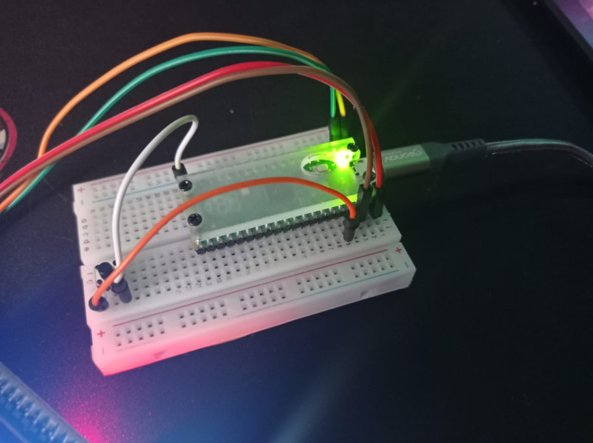
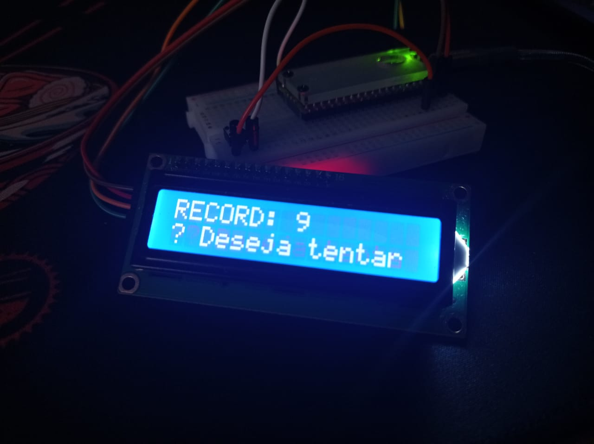

# Jogo Click

## Introdução
O "Jogo Click" é um projeto pessoal para testar os recursos do raspberry pi pico. Onde estou estudando e aprendendo como a placa funciona. 
Com isso, decidi fazer esse pequeno exemplo para fazer algo bem simples e direto. Mas, que já consiga utilizar um display e um button externo.

## Como jogar

Método para iniciar o "jogo". O mesmo funciona da seguinte forma:

    1. O jogador terá que clicar o mais rápido que puder durante 10 segundos (ou mais, caso ajustado).
    
    2. Após a rodada do jogador, será exibido a pontuação do mesmo.
    
    3. Logo após a pontuação, será exibido uma tela com um ranking do maior ponto e uma mensagem de "Deseja tentar novamente?".
    
    4. Caso o jogador queira jogar novamente, para subir de ranking, basta apenas clicar no botão e o jogo começará novamente.

## Requisitos do projeto (hardware)
O mesmo depende de:
* 1x - Raspberry Pi Pico
* 1x - Táctil Push-Button
* 1x - Display LCD 16x02
* 6x - Jumper Macho/Macho

## Fotos do componentes:

